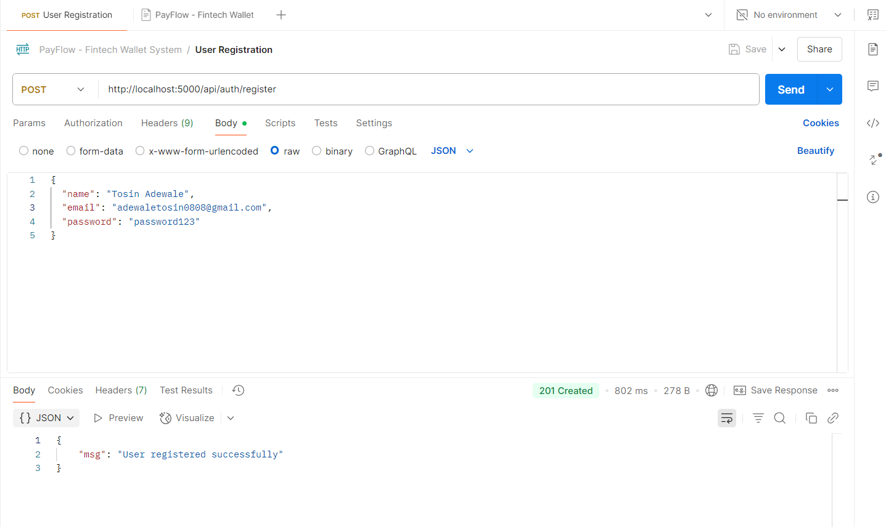
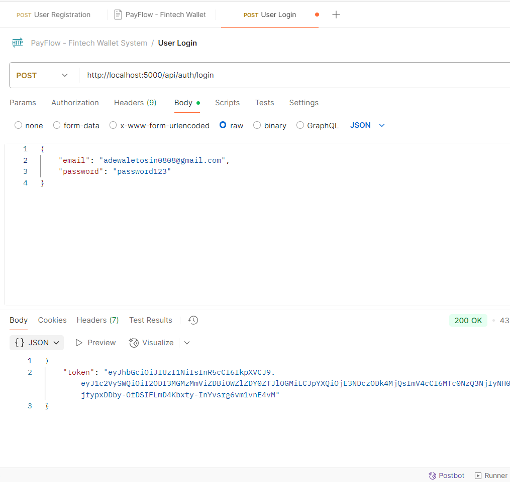
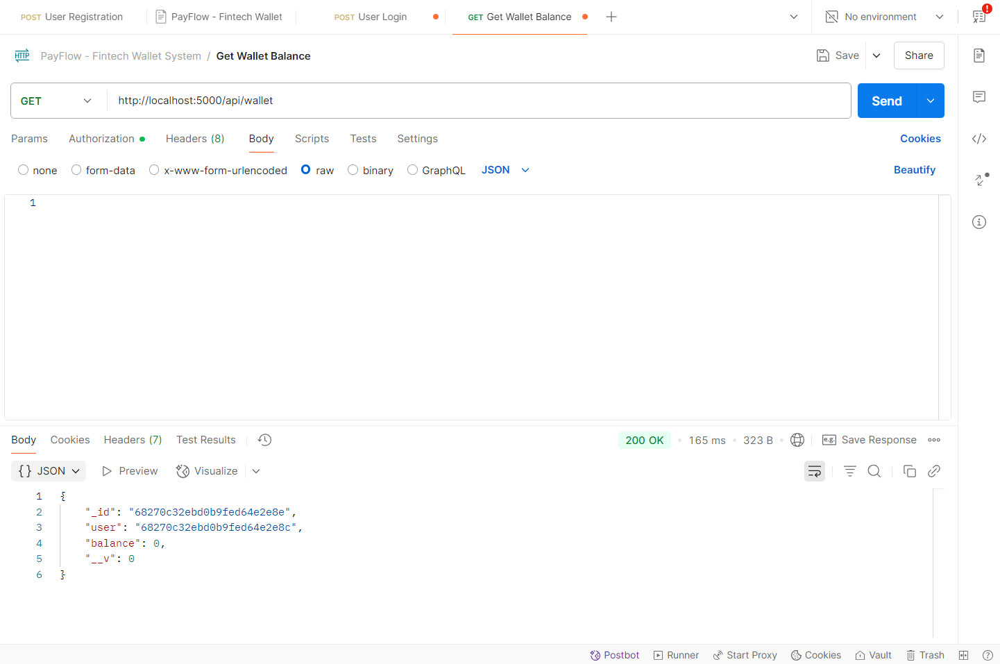
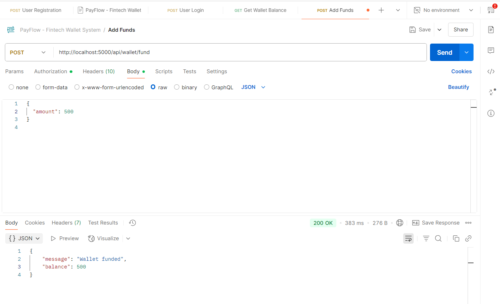
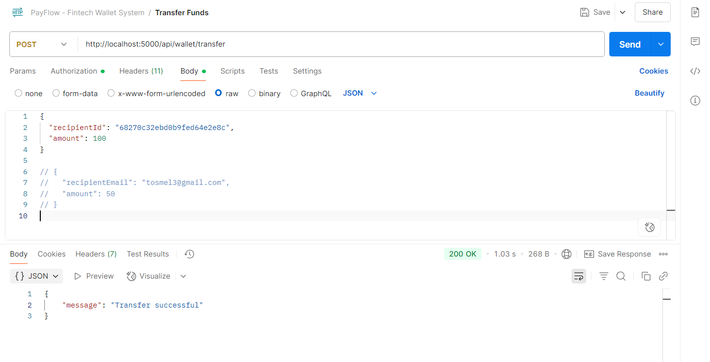
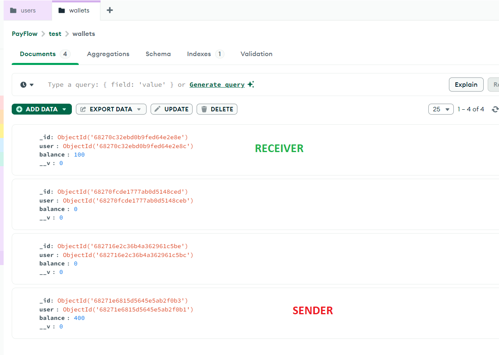
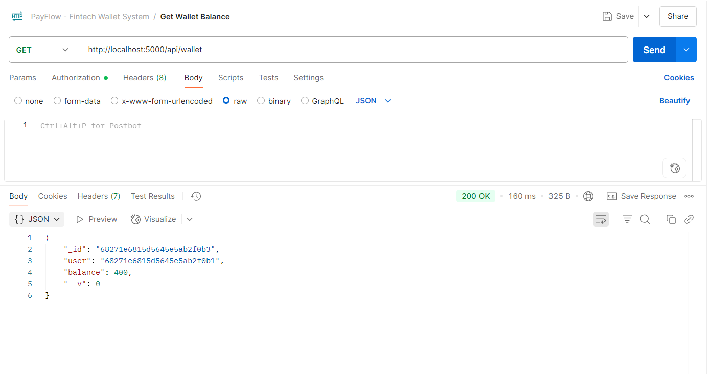
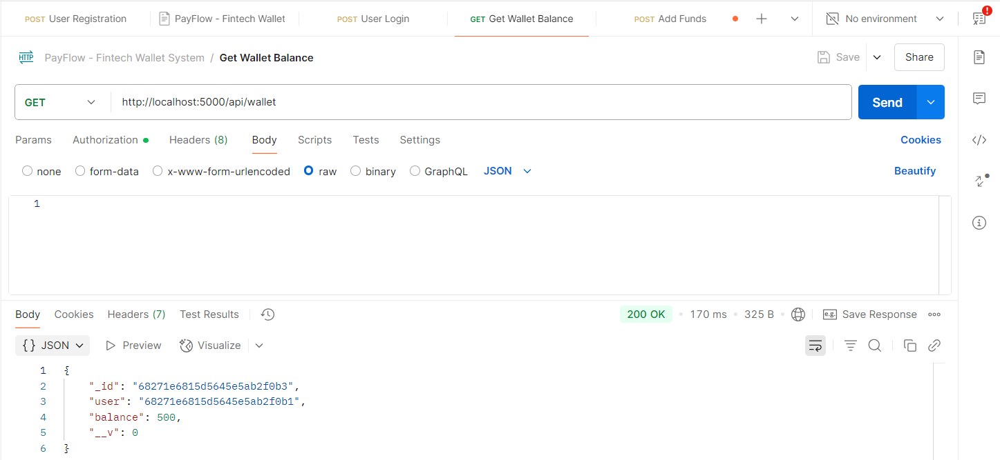
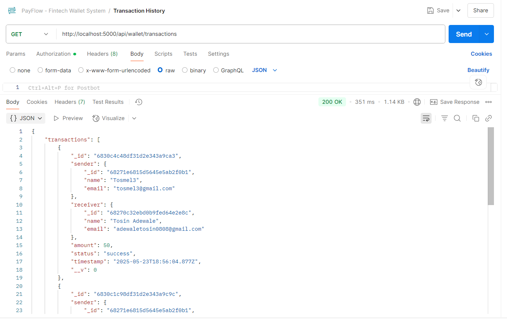

# PAYFLOW_WALLET - Fintech Digital Wallet System (PayFlow)
## Instructions
### User Authentication & Wallet Setup & Money Transfers
1. Implement user registration and login with JWT.
2. Auto-create a wallet on user registration.
3. Setup MongoDB schemas: User and Wallet.
4. Add money transfer logic between wallets. [view image](#transfer-funds)
5. Validate balances before transfers. [view image](#update-funds)<br>
   <strong> Wallet & Transaction History</strong>
4. View Wallet Balance. [view image](#wallet-balance)
5. List all past transactions. [view image](#transaction-history)

### Environment Setup
#### Setup Instructions
1. Clone this repository or extract the zip.
2. Run `npm install` to install dependencies.
3. Set up a MongoDB database and add the connection string to `.env`:
   ```
   PORT=5000
   MONGO_URI=mongodb://127.0.0.1:27017/payflow
   JWT_SECRET=payflow_jwt_secret_key
   ```
4. Start the server:
   ```
   npm run server or nodemon server.js
   ```

#### Folder Structure
<pre>
payflow-wallet-api/
├── controllers/
│   └── authController.js
│   └── walletController.js
├── models/
│   └── User.js
│   └── Wallet.js
│   └── Transaction.js
├── routes/
│   └── authRoutes.js
│   └── walletRoutes.js
├── middleware/
│   └── authMiddleware.js
├── config/
│   └── db.js
├── .env
├── .gitignore
├── package.json
├── server.js
└── README.md
</pre>

### API Endpoints

| Method | Endpoint                     | Description                |
|--------|------------------------------|----------------------------|
| POST   | /api/auth                    | Register User              |
| POST   | /api/auth                    | Login User                 |
| GET    | /api/wallet                  | Get wallet                 |
| POST   | /api/wallet/fund             | Add funds to the wallet    |
| POST   | /api/wallet/transfer         | Transfer Funds to others   |
| GET    | /api/wallet/transactions     | Transaction History        |


### Features
1. Implement user registration and login with JWT.




2. Get Wallet Balance.


3. Add Funds to the Wallet.


4. <p id="transfer-funds">Transfer funds from wallet Balance to others by ID.</p>


5. Transfer and Receive


6. <p id="update-funds">Updated Funds After Transfer.</p>


7. <p id="wallet-balance"> Get Wallet Balance After Funded.</p>


8. <p id="transaction-history">Transaction History.</p>

