# FRESHMART - Supermarket E-Commerce Backend (FreshMart) 
## Instructions
### Authentication & Product Catalog
1. User/admin registration & login.
2. Implement role-based access control.
3. Create Category & Product schemas.
4. Admin can create categories and products.
##### Product Browsing & Orders
5. Users can browse products and view product details. [Go to Image] (#get-Products-details)
6. Users can place orders with multiple items.
7. Create Order schema with order summary logic.

## Environment Setup
### Setup Instructions
1. Clone this repository or extract the zip.
2. Run `npm install` to install dependencies.
3. Set up a MongoDB database and add the connection string to `.env`:
   ```
   PORT=5001
   MONGO_URI=mongodb://127.0.0.1:27017/freshmart
   JWT_SECRET=freshmart_jwt_secret_key
   ```
4. Start the server:
   ```
   npm run dev or nodemon server.js
   ```

### Folder Structure
<pre>
freshmart-backend/
├── config/
│   └── db.js
├── controllers/
│   ├── authController.js
│   ├── productController.js
│   └── categoryController.js
├── middlewares/
│   ├── authMiddleware.js
│   └── roleMiddleware.js
├── models/
│   ├── User.js
│   ├── Product.js
│   └── Category.js
├── routes/
│   ├── authRoutes.js
│   ├── productRoutes.js
│   └── categoryRoutes.js
├── utils/
│   └── generateToken.js
├── .env
├── .gitignore
├── package.json
├── README.md
└── server.js
</pre>

## API Endpoints

| Method | Endpoint                     | Description                |
|--------|------------------------------|----------------------------|
| POST   | /api/auth                    | Register User              |
| POST   | /api/auth                    | Login User                 |
| GET    | /api/products                | Get All Products           |
| GET    | /api/categories              | Get All Categories         |
| POST   | /api/categories              | Create Category(Admin only)|
| POST   | /api/product                 | Create Product (Admin only)|
| POST   | /api/orders                  | Create Orders (Public)     |
| POST   | /api/orders/history          | Get all Orders (Public)    |

### Features
1. Implement user registration and login with JWT.
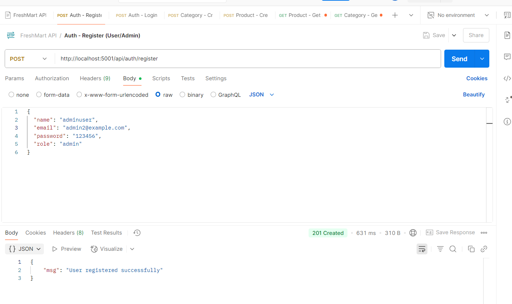

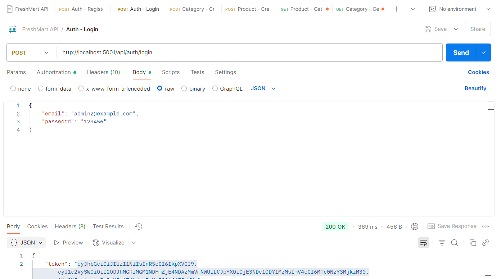

2. Get All Categories.
.png)

3a. Get All Products.
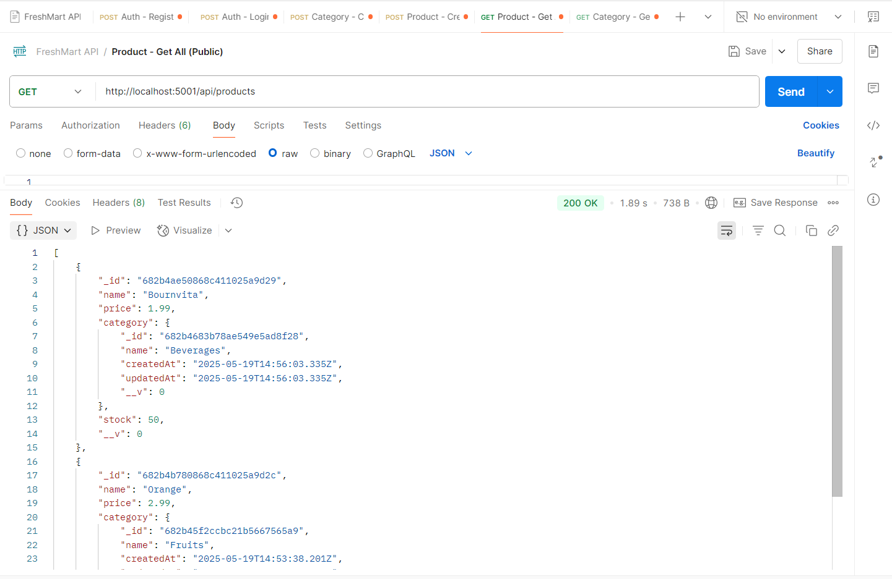

3b. Get All Products.
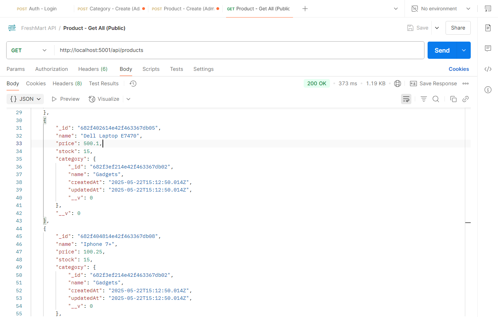

3c. Get Products details.
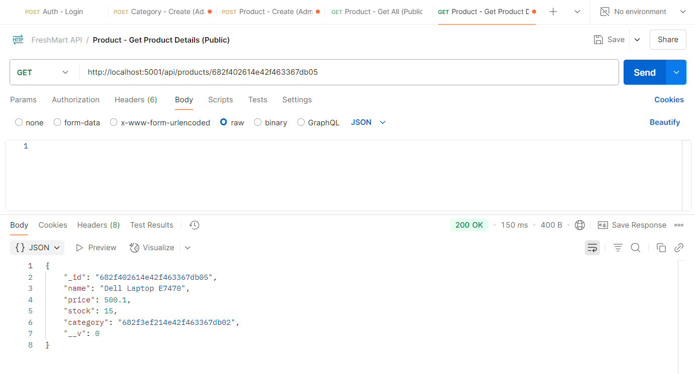

4. Create Category By Admin.


5. Create Product under Category
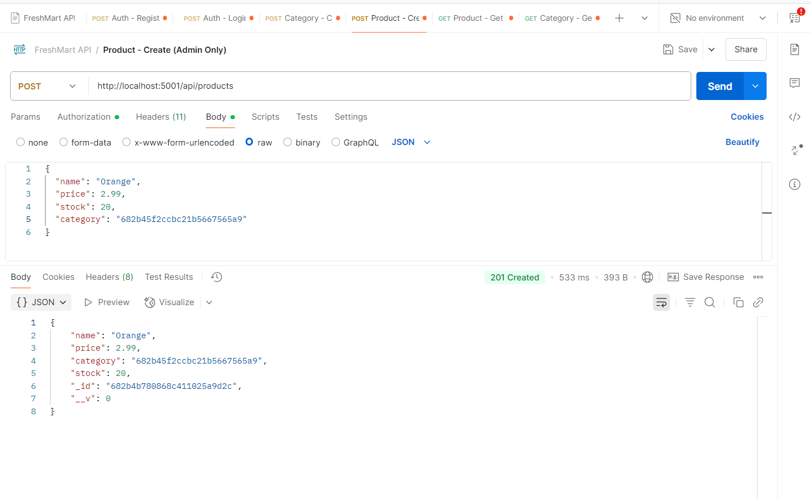

6. Create Product under Category2.
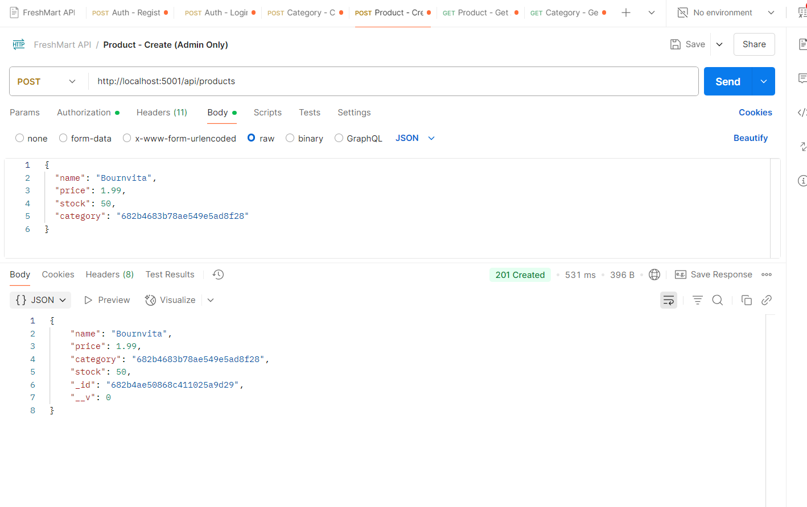

6. As seen on DB
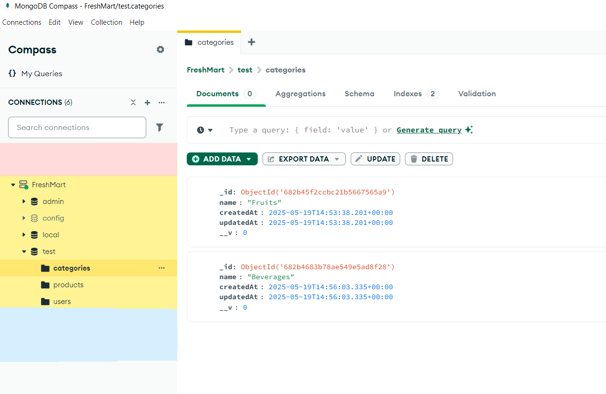

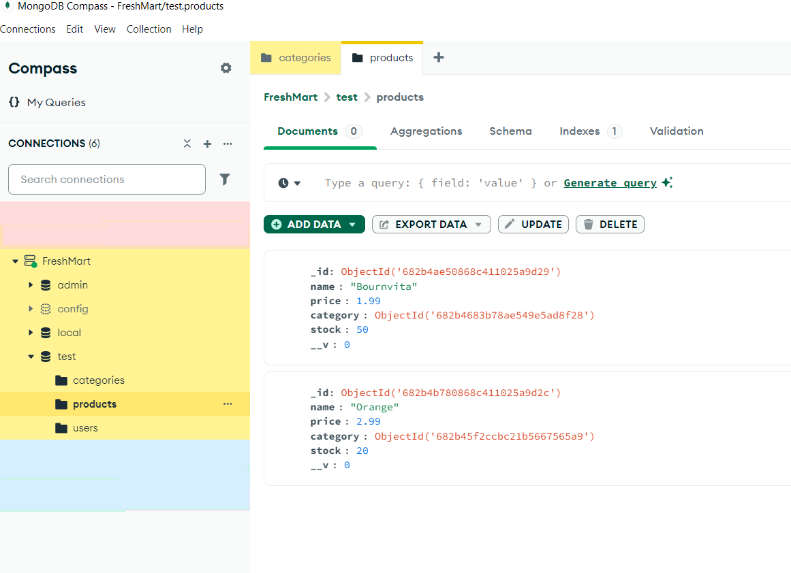

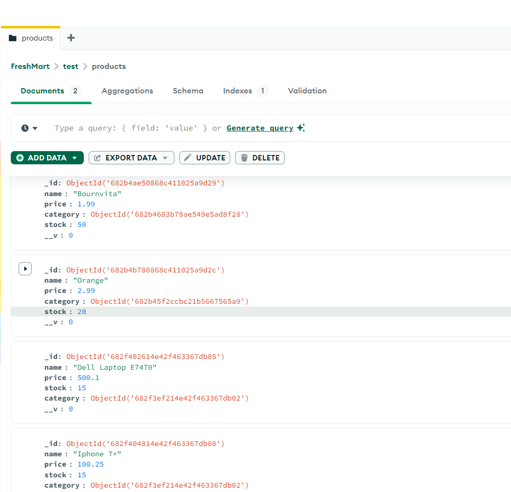

7. Authenticated users can place orders with multiple items (POST /api/orders).
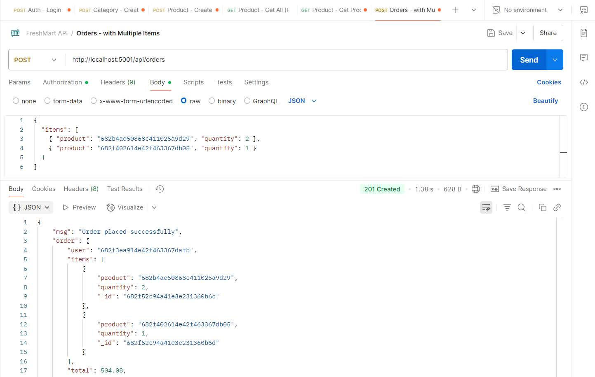

8. Users view all orders history placed.
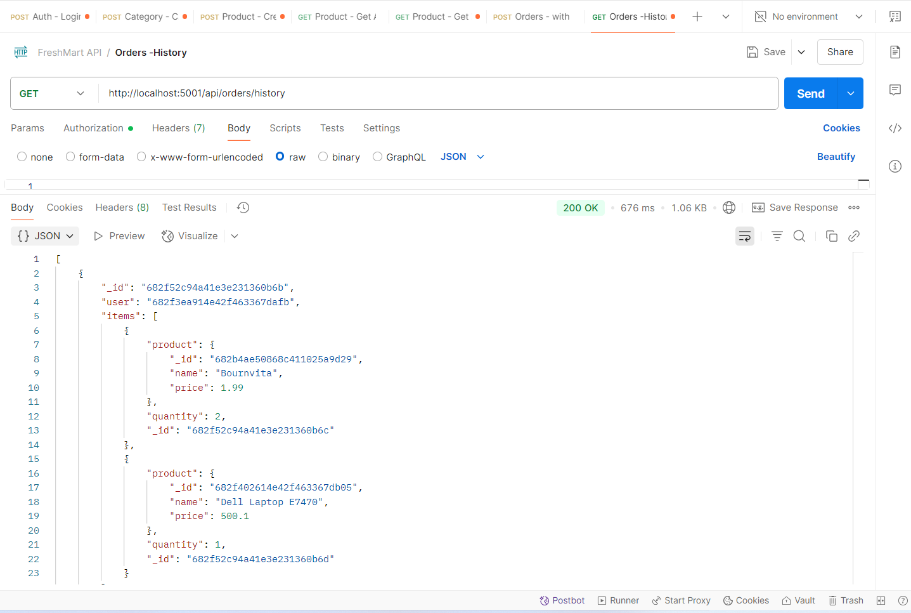