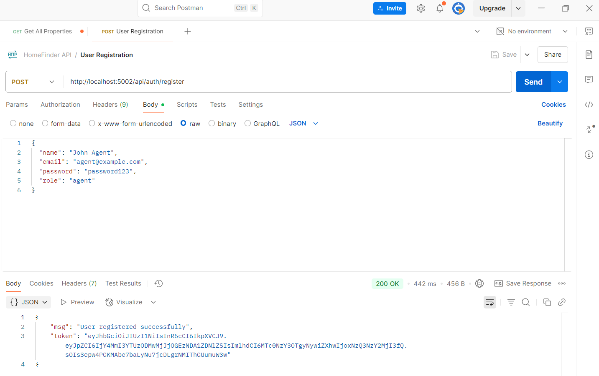

# HOMEFINDER - Real Estate Listing Platform (HomeFinder) 
## Instructions
### Roles & Property Listings
1. Setup user roles: agent and regular user.
2. Agents can add new property listings.
3. Define schemas: User, Property.
   <!-- Browsing & Saving Properties -->
4. Users can view all listings or a specific one.
5. Create SavedProperty schema and endpoint.
6. Allow users to save/unsave properties. [Go to Image](#saved-unsaved)


## Environment Setup
### Setup Instructions
1. Clone this repository or extract the zip.
2. Run `npm install` to install dependencies.
3. Set up a MongoDB database and add the connection string to `.env`:
   ```
   PORT=5002
   MONGO_URI=mongodb://127.0.0.1:27017/homefinder
   JWT_SECRET=freshmart_jwt_secret_key
   ```
4. Start the server:
   ```
   node server.js or nodemon server.js
   ```

### Folder Structure
<pre>
homefinder/
├── controllers/
│   ├── authController.js
│   └── propertyController.js
├── middleware/
│   ├── authMiddleware.js
│   └── roleMiddleware.js
├── models/
│   ├── Property.js
│   └── User.js
├── routes/
│   ├── authRoutes.js
│   └── propertyRoutes.js
├── config/
│   └── db.js
├── .env
├── server.js
├── package.json
</pre>


## API Endpoints

| Method | Endpoint                      | Access     | Description                   |
| ------ | --------------------          | ---------- | ----------------------------- |
| POST   | `/api/auth/register`          | Public     | Register user or agent        |
| POST   | `/api/auth/login`             | Public     | Login and get JWT             |
| GET    | `/api/properties`             | Public     | List all properties           |
| POST   | `/api/properties`             | Agent only | Create a new property listing |
| POST   | `/api/saved-properties/save`  | Public     | Saved a property              |
| POST   | `api/saved-properties/unsave` | Public     | Unsaved a saved properties    |
| GET    | `api/saved-properties/`       | Public     | Get all saved properties      |


### Features
1. Implement user registration with JWT.


2. Implement user login.


2. Create Properties by agents.


3. Get All Properties.


4. Get All Update Properties.


5. Properties on DB.


6. <p id="#saved-unsaved">Allow users to save properties.</p>


7. Allow users to unsave properties.


8. Allow users to view all saved properties.


