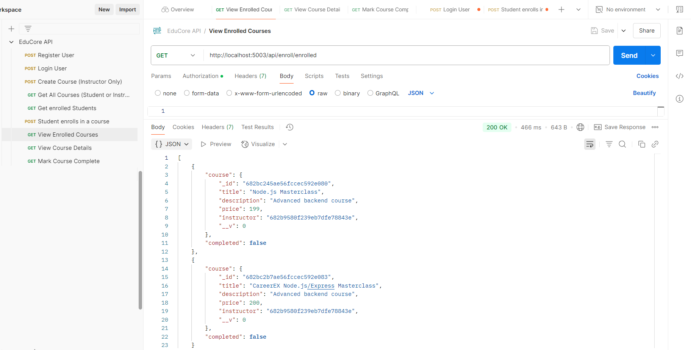

# EDUCORE - E-Learning Platform Backend (EduCore) 
## Instructions
### Authentication & Courses, Enrollment Logic
1. Create user roles: instructor and student.
2. Instructors can create courses.
3. Setup schemas: User, Course. 
4. Students can enroll in available courses. [View Image](#enroll)
5. Create Enrollment schema.
6. Instructors can view enrolled students. [View Image](#view-enroll)
   <strong>Progress & Course Browsing</strong>
7. Students can view their enrolled courses.[View Image](#students-view-enrollcourse)
8. Add course detail route.
9. Add course completion status (simple boolean flag).[View Image](#completion-status)

## Environment Setup
### Setup Instructions
1. Clone this repository or extract the zip.
2. Run `npm install` to install dependencies.
3. Set up a MongoDB database and add the connection string to `.env`:
   ```
   PORT=5003
   MONGO_URI=mongodb://127.0.0.1:27017/educore
   JWT_SECRET=educore_jwt_secret_key
   ```
4. Start the server:
   ```
   npm run dev or nodemon server.js
   ```

### Folder Structure
<pre>
educore-backend/
├── controllers/
│   ├── authController.js
│   └── courseController.js
│   └── enrollmentController.js
├── middlewares/
│   ├── authMiddleware.js
│   └── roleMiddleware.js
├── models/
│   ├── Course.js
│   └── User.js
│   └── Enrollment.js
├── routes/
│   ├── authRoutes.js
│   └── courseRoutes.js
│   └── enrollmentRoutes.js
├── .env.example
├── app.js
├── package.json
├── README.md
└── config/
    └── db.js
</pre>


## API Endpoints

| Method | Endpoint                   | Access           | Description                   |
| ------ | -------------------------  | ---------------- | --------------------          |
| POST   | `/api/auth/register`       | Public           | Register user                 |
| POST   | `/api/auth/login`          | Public           | Login and get JWT             |
| GET    | `/api/courses   `          | Public           | List all courses              |
| POST   | `/api/courses   `          | Instructor only  | Create a course               |
| POST   | `/api/enroll    `          | Student          | Enroll for a course           |
| GET    | `/courses/:courseId/students`| Instructor only | View enrolled students        |
| GET    | `/api/courses/enrolled`     | Public           | View enrolled Courses         |
| GET    | `/api/courses/:courseId`    | Pubic            | View Course details           |
| POST   | `/courses/:courseId/complete`| Public          | Mark Course as Completed      |


### Features
1. Implement user registration with JWT.


2. Implement user login.


2. Create courses by instructor.


3. Get All Courses.


4. Properties on DB.


5. <p id="enroll">Student enrolls in a course</p>


6. <p id="view-enroll">Instructor views students in a course</p>


7. <p id="students-view-enrollcourse">Students View Enrolled Courses</p>


8. <p id="completion-status">Course Completion Status</p>


