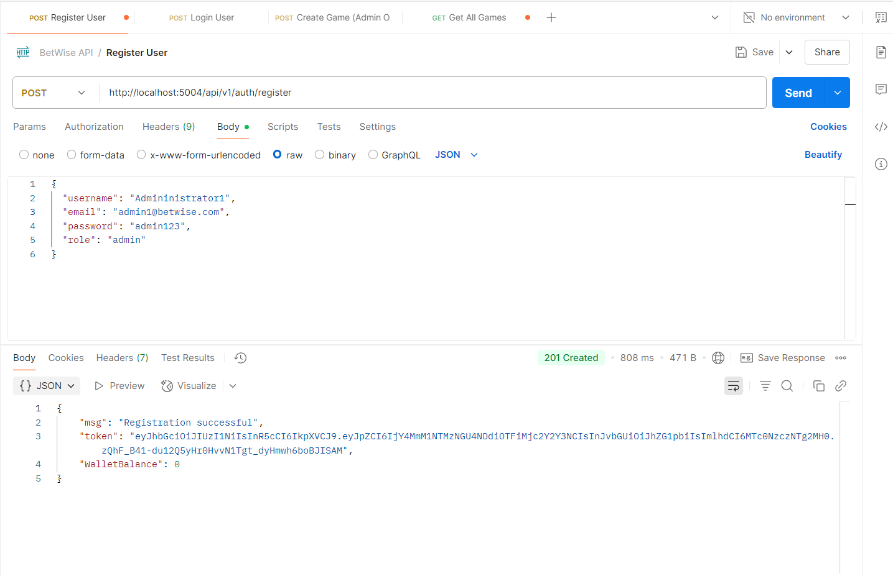
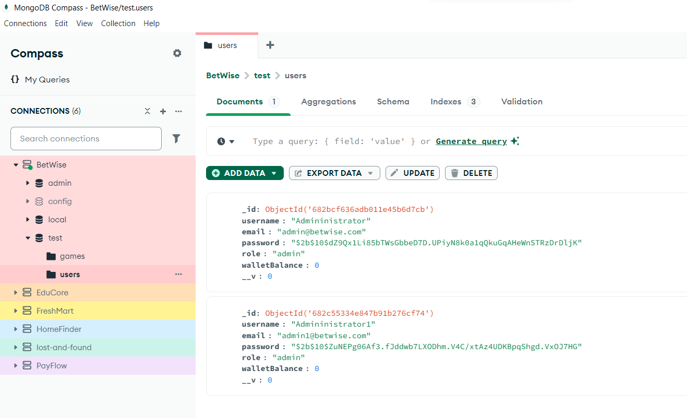
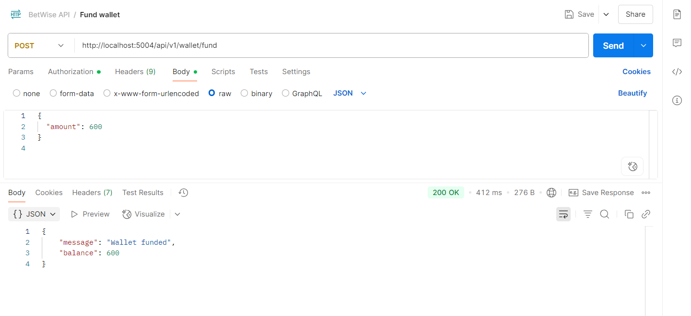
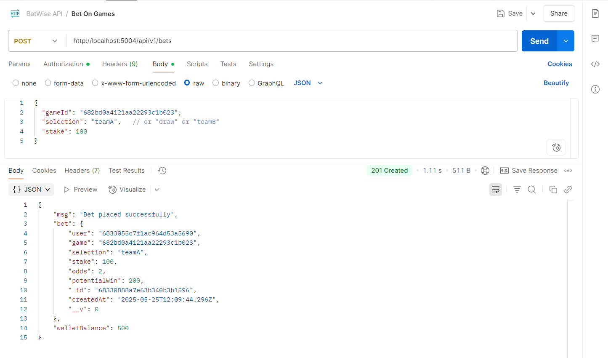
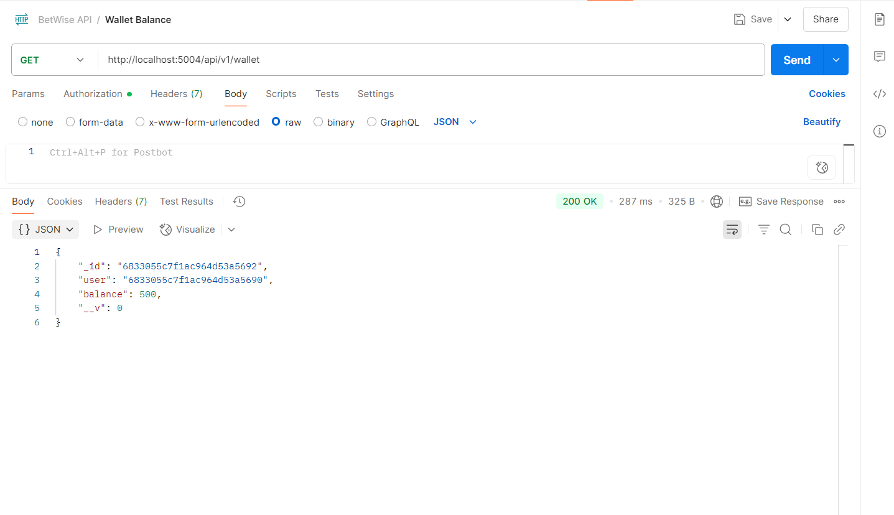

# BetWise - Sports Betting Platform (BetWise) 
## Instructions
### User Setup, Game Management & Bet mgt Logic
1. Register/login users with wallet balance.
2. Admin can create games with odds.
3. Define User, Game schemas.
Betting Logic
4. Users place bets on available games.[view image](#bet-placed)
5. Create Bet schema. [view image](#wallet-funded)
6. Deduct stake from wallet and record bet. [view image](#wallet-balance)


## Environment Setup
### Setup Instructions
1. Clone this repository or extract the zip.
2. Run `npm install` to install dependencies.
3. Set up a MongoDB database and add the connection string to `.env`:
   ```
   PORT=5004
   MONGO_URI=mongodb://127.0.0.1:27017/betwise
   JWT_SECRET=betwise_jwt_secret_key
   ```
4. Start the server:
   ```
   npm run dev or nodemon server.js
   ```


### Folder Structure
<pre>
BetWise/
├── controllers/
│   ├── authController.js
│   └── gameController.js
├── middleware/
│   ├── authMiddleware.js
│   └── roleMiddleware.js
├── models/
│   ├── Game.js
│   └── User.js
├── routes/
│   ├── authRoutes.js
│   └── gameoutes.js
├── config/
│   └── db.js
├── .env
├── server.js
├── package.json
</pre>


## API Endpoints

| Method | Endpoint                | Access     | Description                   |
| ------ | ----------------------- | ---------- | ----------------------------- |
| POST   | `/api/v1/auth/register` | Public     | Register user                 |
| POST   | `/api/v1/auth/login`    | Public     | Login and get JWT             |
| GET    | `/api/v1/games     `    | Public     | List all games                |
| POST   | `/api/v1/games`         | admin only | Create a new game             |
| POST   | `/api/wallet/fund`      | public     | Fund Wallet Manually          |
| POST   | `/api/v1/bets`          | public     | Bet(stake) on games           |
| POST   | `/api/v1/wallet`        | public     | Wallet Balance After Stake    |


### Features
1. Implement user registration and login with JWT.


1. Implement user registration with Wallet Balance


2. 

3. Create Game by Admin.


4. Get All Games.


5. All Games DB.


6. All Users Details DB.


7. <p id="wallet-funded">Wallet Funded(Manual).</p>


8. <p id="bet-placed">Bet(Stake) on Games.</p>


9. <p id="wallet-balance">Wallet Balance after Bet(Stake).</p>
