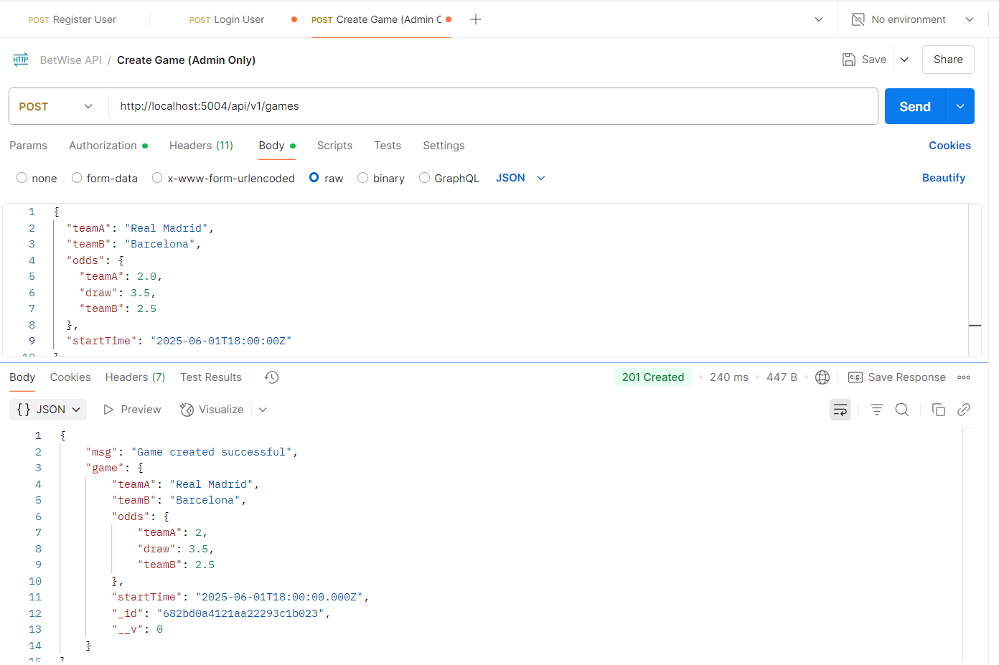

# BetWise - Sports Betting Platform (BetWise) 
## Instructions
### User Setup & Game Management
1. Register/login users with wallet balance.
2. Admin can create games with odds.
3. Define User, Game schemas.

## Environment Setup
### Setup Instructions
1. Clone this repository or extract the zip.
2. Run `npm install` to install dependencies.
3. Set up a MongoDB database and add the connection string to `.env`:
   ```
   PORT=5004
   MONGO_URI=mongodb://127.0.0.1:27017/betwise
   JWT_SECRET=betwise_jwt_secret_key
   ```
4. Start the server:
   ```
   node server.js or nodemon server.js
   ```


### Folder Structure
<pre>
BetWise/
├── controllers/
│   ├── authController.js
│   └── gameController.js
├── middleware/
│   ├── authMiddleware.js
│   └── roleMiddleware.js
├── models/
│   ├── Game.js
│   └── User.js
├── routes/
│   ├── authRoutes.js
│   └── gameoutes.js
├── config/
│   └── db.js
├── .env
├── server.js
├── package.json
</pre>


## API Endpoints

| Method | Endpoint             | Access     | Description                   |
| ------ | -------------------- | ---------- | ----------------------------- |
| POST   | `/api/auth/register` | Public     | Register user                 |
| POST   | `/api/auth/login`    | Public     | Login and get JWT             |
| GET    | `/api/games     `    | Public     | List all games                |
| POST   | `/api/game`          | admin only | Create a new game             |


### Features
1. Implement user registration and login with JWT.


2. 

3. Create Game by Admin.




4. Get All Games.


5. All Games DB.

