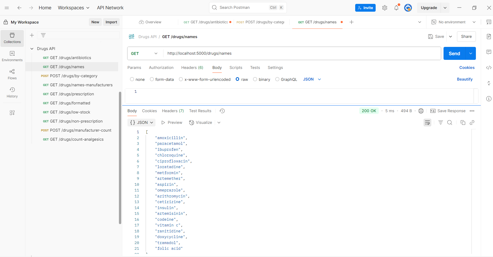

## WEEK 6 ASSIGNMENT: Node.js Express API Assignment


#### Instructions: You are going to build simple APIs using Node.js and Express. Use the drugs array given below as your "database" inside the server.

##### Important:

Use express.json() to handle incoming POST request bodies.
Test all your APIs using Postman.


<!-- The Drugs Array -->

const drugs = [

 { id: 1, name: "Amoxicillin", category: "Antibiotic", dosageMg: 500, isPrescriptionOnly: true, stock: 120, manufacturer: "Pfizer" },

 { id: 2, name: "Paracetamol", category: "Analgesic", dosageMg: 1000, isPrescriptionOnly: false, stock: 200, manufacturer: "GSK" },

 { id: 3, name: "Ibuprofen", category: "Analgesic", dosageMg: 400, isPrescriptionOnly: false, stock: 150, manufacturer: "Bayer" },

 { id: 4, name: "Chloroquine", category: "Antimalarial", dosageMg: 250, isPrescriptionOnly: true, stock: 80, manufacturer: "Sanofi" },

 { id: 5, name: "Ciprofloxacin", category: "Antibiotic", dosageMg: 500, isPrescriptionOnly: true, stock: 70, manufacturer: "Pfizer" },

 { id: 6, name: "Loratadine", category: "Antihistamine", dosageMg: 10, isPrescriptionOnly: false, stock: 160, manufacturer: "Novartis" },

 { id: 7, name: "Metformin", category: "Antidiabetic", dosageMg: 850, isPrescriptionOnly: true, stock: 140, manufacturer: "Teva" },

 { id: 8, name: "Artemether", category: "Antimalarial", dosageMg: 20, isPrescriptionOnly: true, stock: 60, manufacturer: "Roche" },

 { id: 9, name: "Aspirin", category: "Analgesic", dosageMg: 300, isPrescriptionOnly: false, stock: 180, manufacturer: "Bayer" },

 { id: 10, name: "Omeprazole", category: "Antacid", dosageMg: 20, isPrescriptionOnly: true, stock: 90, manufacturer: "AstraZeneca" },

 { id: 11, name: "Azithromycin", category: "Antibiotic", dosageMg: 250, isPrescriptionOnly: true, stock: 50, manufacturer: "Pfizer" },

 { id: 12, name: "Cetirizine", category: "Antihistamine", dosageMg: 10, isPrescriptionOnly: false, stock: 110, manufacturer: "Novartis" },

 { id: 13, name: "Insulin", category: "Antidiabetic", dosageMg: 100, isPrescriptionOnly: true, stock: 30, manufacturer: "Novo Nordisk" },

 { id: 14, name: "Artemisinin", category: "Antimalarial", dosageMg: 100, isPrescriptionOnly: true, stock: 50, manufacturer: "GSK" },

 { id: 15, name: "Codeine", category: "Analgesic", dosageMg: 30, isPrescriptionOnly: true, stock: 20, manufacturer: "Teva" },

 { id: 16, name: "Vitamin C", category: "Supplement", dosageMg: 500, isPrescriptionOnly: false, stock: 300, manufacturer: "Nature’s Bounty" },

 { id: 17, name: "Ranitidine", category: "Antacid", dosageMg: 150, isPrescriptionOnly: false, stock: 90, manufacturer: "Sanofi" },

 { id: 18, name: "Doxycycline", category: "Antibiotic", dosageMg: 100, isPrescriptionOnly: true, stock: 40, manufacturer: "Pfizer" },

 { id: 19, name: "Tramadol", category: "Analgesic", dosageMg: 50, isPrescriptionOnly: true, stock: 45, manufacturer: "Teva" },

 { id: 20, name: "Folic Acid", category: "Supplement", dosageMg: 5, isPrescriptionOnly: false, stock: 250, manufacturer: "Nature’s Bounty" }

];


##### Tasks

1. GET /drugs/antibiotics
Return all drugs where category is "Antibiotic".


2. GET /drugs/names
Return an array of all drug names converted to lowercase.



3. POST /drugs/by-category
Accept a category in the body and return all drugs under that category.
Example body: { "category": "Antibiotic" }


4. GET /drugs/names-manufacturers
Return an array of objects showing each drug’s name and manufacturer.


5. GET /drugs/prescription
Return all drugs where isPrescriptionOnly is true.


6. GET /drugs/formatted
Return a new array where each item is a string like:
"Drug: [name] - [dosageMg]mg"


7. GET /drugs/low-stock
Return all drugs where stock is less than 50.


8. GET /drugs/non-prescription
Return all drugs where isPrescriptionOnly is false.


9. POST /drugs/manufacturer-count
Accept a manufacturer in the body and return how many drugs are produced by that manufacturer.
Example body: { "manufacturer": "Pfizer" }


10. GET /drugs/count-analgesics
Count and return how many drugs have the category "Analgesic".


=======================================================================================

### Step By Step Guides

#  Drugs API - Node.js + Express

This is a simple RESTful API built with **Node.js** and **Express**. It provides endpoints to retrieve and filter information from a static list of drugs.

---

##  Step 1: Setup Project

1. Make a project folder and initialize Node.js:

```bash
mkdir drugs-api
cd drugs-api
npm init -y
```
2. Install Express:

```bash
npm install express
```

##   Step 2: Create server.js
Inside your project folder, create a file called server.js and paste the server.js code:

##  Step 3: Run the Server
Use the command below to start your server:

```bash
node server.js
```

You should see:
Drugs API running at ```http://localhost:5000 ```

##  Step 4: Test with Postman
Open Postman.

Use the following endpoints:
| Method | Endpoint                          | Description                               |
|--------|-----------------------------------|-------------------------------------------|
| GET    | `/drugs/antibiotics`              | Get all antibiotics                       |
| GET    | `/drugs/names`                    | Get all drug names in lowercase           |
| POST   | `/drugs/by-category`              | Get drugs by category (send JSON body)    |
| GET    | `/drugs/names-manufacturers`      | Get each drug’s name and manufacturer     |
| GET    | `/drugs/prescription`             | Get prescription-only drugs               |
| GET    | `/drugs/formatted`                | Get string-formatted drug data            |
| GET    | `/drugs/low-stock`                | Get drugs with stock less than 50         |
| GET    | `/drugs/non-prescription`         | Get non-prescription drugs                |
| POST   | `/drugs/manufacturer-count`       | Get count of drugs by manufacturer        |
| GET    | `/drugs/count-analgesics`         | Count how many drugs are Analgesics       |
