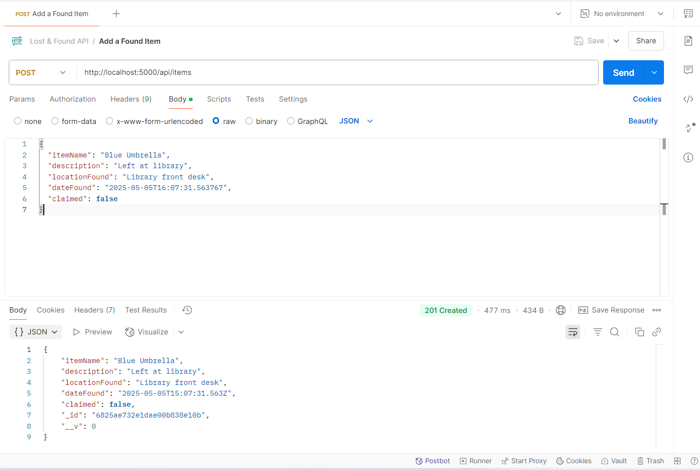
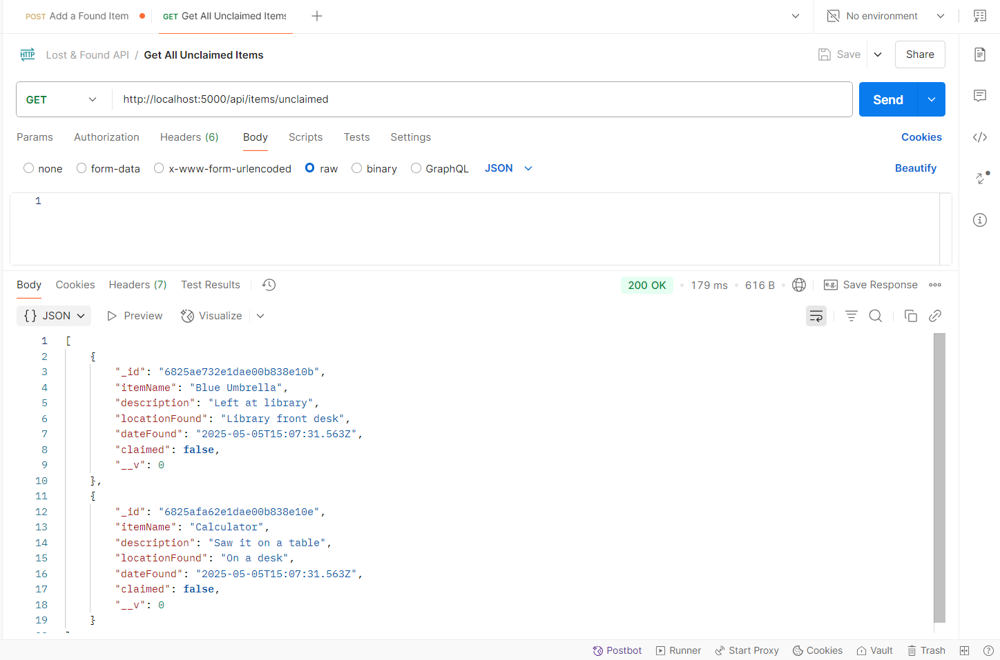
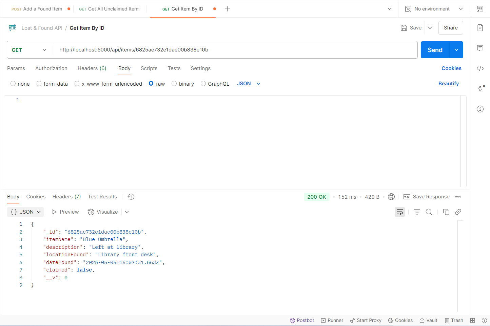
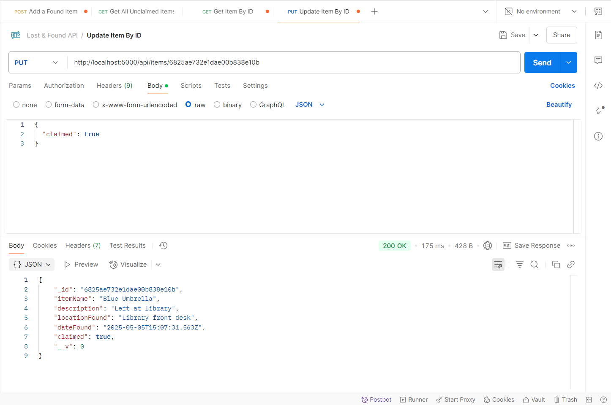
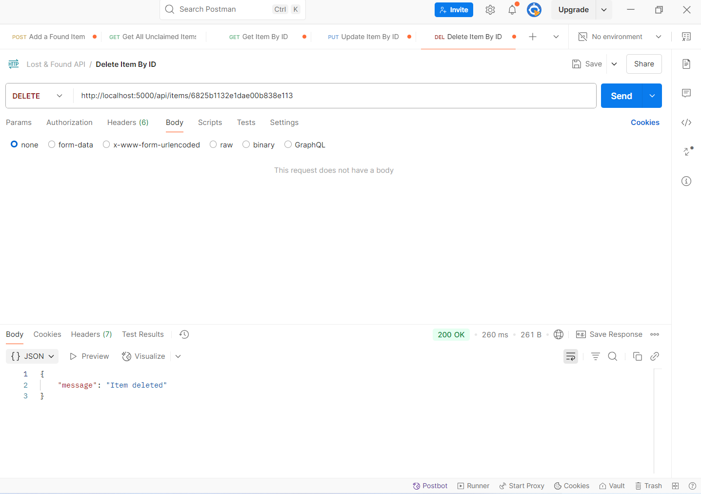
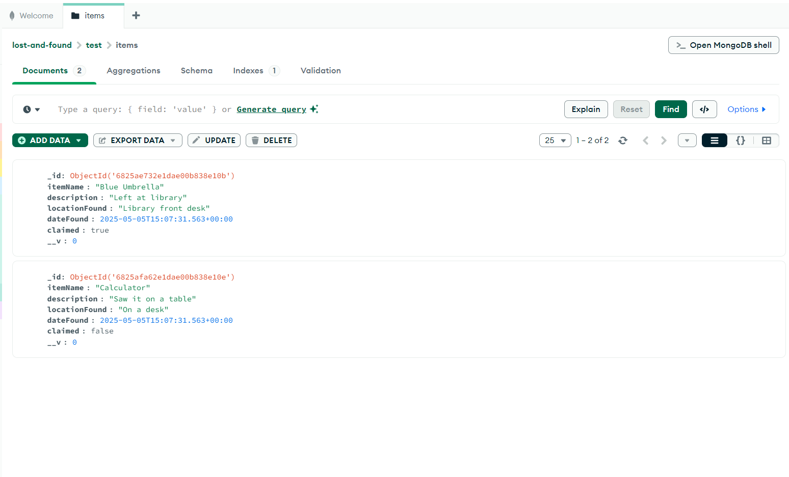
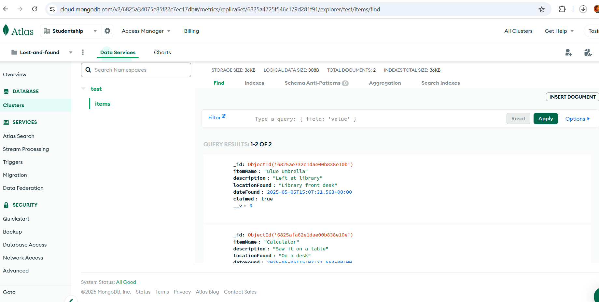

# Lost & Found Backend API

This is a backend server for a campus Lost & Found system built using Node.js, Express, and MongoDB.

## Setup Instructions

1. Clone this repository or extract the zip.
2. Run `npm install` to install dependencies.
3. Set up a MongoDB database and add the connection string to `.env`:
   ```
   MONGO_URI=mongodb://localhost:27017/lost-and-found
   ```
4. Start the server:
   ```
   node server.js
   ```

## API Endpoints

| Method | Endpoint                     | Description                |
|--------|------------------------------|----------------------------|
| POST   | /api/items                   | Add a new item             |
| GET    | /api/items/unclaimed         | Get all unclaimed items    |
| GET    | /api/items/:id               | Get item by ID             |
| PUT    | /api/items/:id               | Update item details        |
| DELETE | /api/items/:id               | Delete item by ID          |

## Postman

Import `lost-found.postman_collection.json` into Postman to test the endpoints.


## Features

- Add a new found item


- View all unclaimed items


- View details of a single item


- Update an item's info or claim status


- Delete outdated items


- Database



